# Can We make Profit from Tweets?
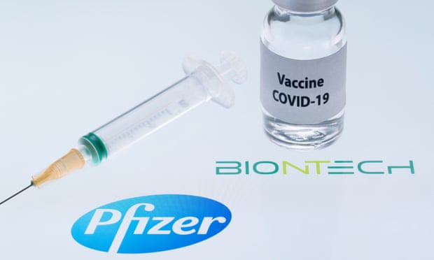

This project aims to analyse if Tweets about covidvaccine can help us make some predicitons on US share markets and make some profits afterwards. Here we choose Pfizer as an example, as it is the largest provider of vaccine now. 

## Motivation
---
We choose this topic mainly because a lot of large twitter influencers such as Elon Musk can affect the prices of different assets to some extent. And the strenth of their influence becomes stronger than before in pandemic period. Therefore, we want to dig into this field and check whether or not we can get to learn the relationship between tweets and share prices by using machine learning models. 

## Job Description Role
---
**Raj**:  Data Fetching 

**Nimendra and Samuel**: Data Cleaning and NLP of Tweets 

**Paul and Okenna**: Model Building and Testing

## Installation
---
pip install tweepy

pip install yfinance

## Data and Pyfiles 
---
### data provided for this project:

[tweets.csv](Resources/tweets.csv)

[PFE_15m.csv](Resources/Pfizer.csv)

[PFE_30m.csv](Resources/pfe_30m.csv)

[PFE_60m.csv](Resources/pfe_60m.csv)

### Pyfiles used in project:

[Download_Tweets](download_tweets.py): Build to scrape tweets from twitter api  
``` Notice: this one can only scrape tweets in 7 days ```

[Fetch Stocks](fetch_share_price.py): Download intraday stock prices from Alpha Api. ```Frequency: 1, 5, 15, 30, 60 minutes ```

[NLP](tweets_nlp.py): Build NLP and generate word clouds from these tweets

[Data_Clean](data_cleaning.py): Clean tweets dataframe and share prices for Machine Learning Models

[Random_Forest](Machine_Learning_Models/random_forest.py): Build and Save Random Forest Model

[Bayes](Machine_Learning_Models/gnb.py): Build and Save GaussianNB Model

[Gradient_Boost](Machine_Learning_Models/gradient_boost.py): Build and Save Gradient Boost Tree Model

[LSTM](Machine_Learning_Models/rnn.py): Build and Save LSTM Model

[Algo_Trading](algo_trading.py): Build and Save Random Forest Model for Algo Trading

### Jupyter Notebooks:

[Model_Train](project_model_train.ipynb): Use pyfile above to train and save models

``` Notice: Please run this one first to train and save models for following parts ```

[Model_Test](project_model_evaluation.ipynb): Test and Evaluate Trained Models

[Model_Prediction](project_model_prediction.ipynb): Use Trained Models and Current Tweets Data to Predict 

## Analysis
---

We use three different classifiction models: random forest, GaussianNB and Gradient Boost tree, one regression deep learning model: LSTM to analyse how tweets can predict returns of Pfizer in 15 mins, 30 mins and 60 mins. The results are shown below.

### 15 Minutes Interval Models

#### Classification Report of Random Forest Model

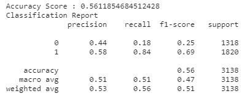

#### Classification Report of GaussianNB Model

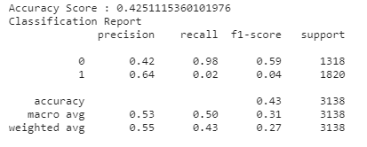

#### Classification Report of Gradient Boost Tree Model

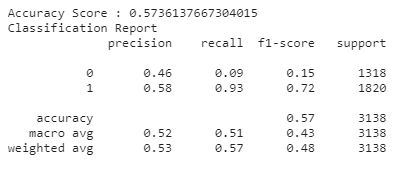

It is not surprised that Gradient Boost Tree got a better accuracy score than the other two, however, GaussionNB had a much better recall for 0 (non_positive return). 

### 30 Minutes Interval Models

#### Classification Report of Random Forest Model

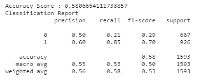

#### Classification Report of GaussianNB Model

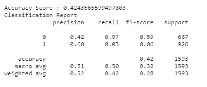

#### Classification Report of Gradient Boost Tree Model

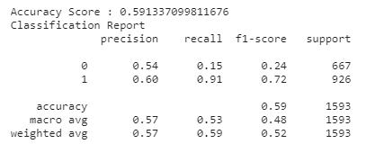

It is not surprised that Gradient Boost Tree got a better accuracy score than the other two and all models performed better than they are in 15 minutes. 

### 60 Minutes Interval Models

#### Classification Report of Random Forest Model

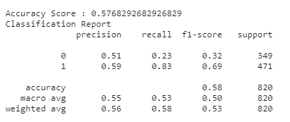

#### Classification Report of GaussianNB Model

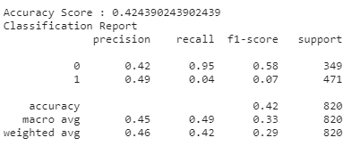

#### Classification Report of Gradient Boost Tree Model

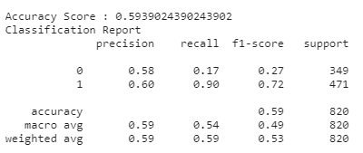

Gradient Boost Tree was still the best in predicting returns when we resample all data into one hour interval. All models performed better than they are in other two time intervals. 

### Algo Trading
---
Based on the results showed above, we used compound sentiment score, long-short moving average and bollinger bands as trading signal to build a algo traing strategy based on random forest model in these three time frequencies. Not surprisingly, trading on 60 minutes made the most of profit (18% return) in the first month of 2021. 

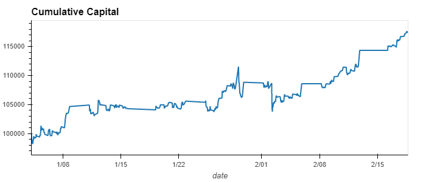

## More Use
---

If you want, you can fetch more tweets based on different key words and share price from other companies to check our trading strategy. We will also include a streaming api in our model to help it run automatically with real-time tweets. Then everyone can type in a single key word and tickers to get a prediction. 
